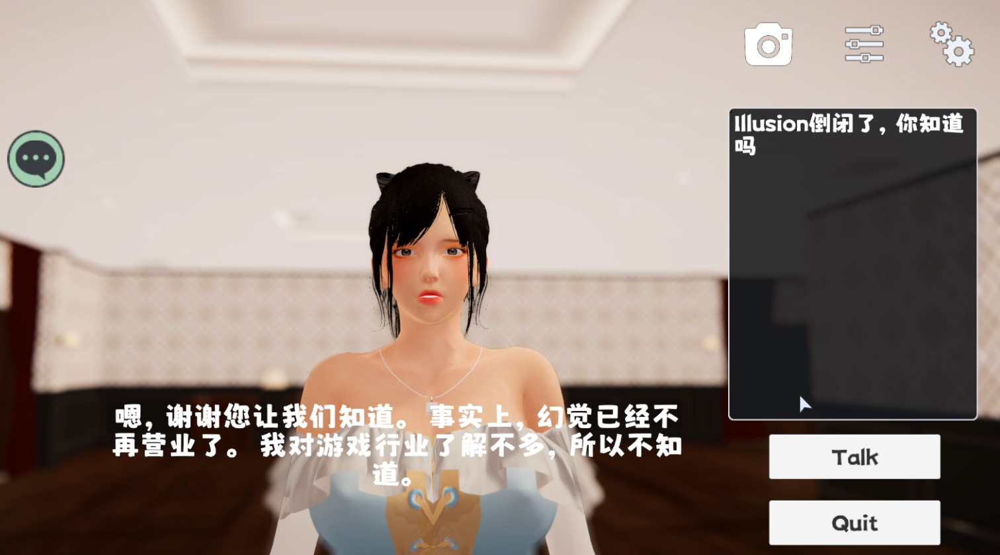

# VirtualHuman

VirtualHuman is a plugin that quickly uses your large language model and speech generation model in the Unity engine, which can be used to realize functions such as AI girlfriend and AI assistant.

It is important to note that this plugin does not provide any models.

## Demo

Bilibili: https://www.bilibili.com/video/BV1fX4y1E7ra/

## Dependency (Unity)
1. TextMeshPro
2. Newtonsoft.Json

## Environment configuration (non-Unity)
1. KoboldAI-KoboldCPP https://github.com/LostRuins/koboldcpp
(If you don’t need to run the language model locally, you don’t need to use ChatGPT)
2. VITS Simple API https://github.com/Artrajz/vits-simple-api

## How to use
1. Open the sample scene Sample.unity
2. Configure the address and port of VITSController
3. Select the type of LLM to use (if not used, the voice will be generated directly by VITS after the translation process)
4. Configure the corresponding LLM Controller
5. Select the translation process
6. Configure the language type of translation, <b>Language Code</b> please refer to (https://cloud.google.com/translate/docs/languages) to fill in

## LLM type description

### ChatGPT 3.5
- Please ensure the corresponding network environment when using ChatGPT
1. Fill in OpenAI's <b>APIKey</b> in GPTController
2. Fill in ``alwaysInclude`` to always send content, such as character settings

### KoboldAI-KoboldCPP
- KoboldAI-KoboldCPP is not a model but a text generation software for loading models
- You can use any supported LLM model in KoboldCPP
1. Fill in the address and port in KoboldController
2. Fill in character settings in ``charaPreset``
3. Click ``Generate Memory`` to serialize the above settings to ``generatedMemory``
4. ``Smart Reading`` makes VITS skip Kobold-generated action and character expression descriptions (usually start and end with ``*``)

## other instructions

### Google Translation
- Checking any translation options will use Google Translate, so please ensure the corresponding network environment
- ``Tranlsate UI2LLM``: Translate user input to LLM. For example, local LLM recommends translating to English before sending it to LLM. ChatGPT does not need this operation
- ``Translate LLM2VITS``: Translate LLM output to VITS speech synthesis, for example, local LLM output English translation into Japanese and then send it to VITS
- ``Translate LLM2UI``: Translate the LLM output to the user display, for example, ChatGPT outputs Japanese, translates to Chinese and then displays it on the UI component of Unity

## Integration function to be added
- Text-Generation-WebUI
- ChatGPT 4.0