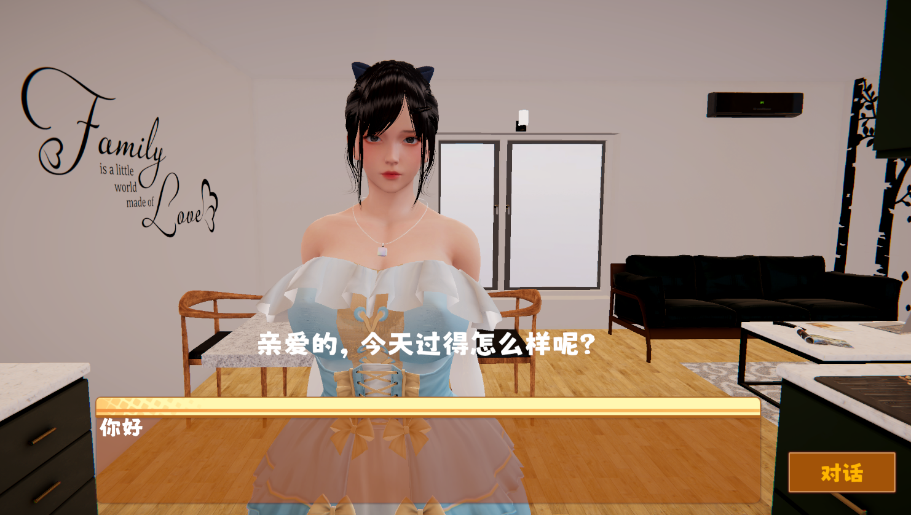

# VirtualHuman

VirtualHuman是一个快速在Unity引擎中使用您的大语言模型、语音生成模型的插件，可用于实现AI女友、AI助手等功能。

需要注意的是，此插件不提供任何模型。

## 演示 

哔哩哔哩: https://www.bilibili.com/video/BV1fX4y1E7ra/

使用LLM&&VITS在Unity中制作AI女友的示例。

配合uLipSync同步唇形的示例 (https://github.com/hecomi/uLipSync) 。

## 环境配置（非Unity）
1. KoboldAI-KoboldCPP https://github.com/LostRuins/koboldcpp
（如不需要本地运行语言模型即使用ChatGPT可不需要）
2. VITS Simple API https://github.com/Artrajz/vits-simple-api

## 使用方式
1. 打开示例场景Sample.unity
2. 配置VITSController的地址和端口
3. 选择使用的LLM类型（如不使用则在翻译流程后由VITS直接进行语音生成）
4. 配置相应的LLM Controller
5. 选择翻译的流程
6. 配置翻译的语言类型，<b>Language Code</b>请参考(https://cloud.google.com/translate/docs/languages)填写

## LLM类型说明

### ChatGPT 3.5
- 使用ChatGPT请确保相应的网络环境
1. 在GPTController中填写OpenAI的<b>APIKey</b>
2. 在``alwaysInclude``中填写始终发送的内容，例如“使用日语回答”
3. 在``m_Prompt``中填写人物设定、背景设定等

### KoboldAI-KoboldCPP
- KoboldAI-KoboldCPP并非一个模型而是用于加载模型的文本生成软件
- 你可以在KoboldCPP中使用任何支持的LLM模型
1. 在KoboldController中填写地址和端口
2. 在``charaPreset``中填写人物设定
3. 点击``Generate Memory``序列化上述设定至``generatedMemory``
4. ``Smart Reading`` 使VITS跳过Kobold生成的动作、人物表情描述（通常以``*``开头和结尾）

## 其他说明

### Google Translation
- 勾选任何翻译选项都将使用Google翻译，因此请确保相应的网络环境
- ``Tranlsate UI2LLM``：对用户输入到LLM进行翻译，例如本地LLM建议翻译为英文后再传给LLM，ChatGPT无需此操作
- ``Translate LLM2VITS``：对LLM输出到VITS语音合成进行翻译，例如本地LLM输出英文翻译为日文后再传给VITS
- ``Translate LLM2UI``：对LLM输出到用户显示进行翻译，例如ChatGPT输出日文，翻译为中文后再显示在Unity的UI组件上

## 待添加整合功能
- Text-Generation-WebUI
- ChatGPT 4.0