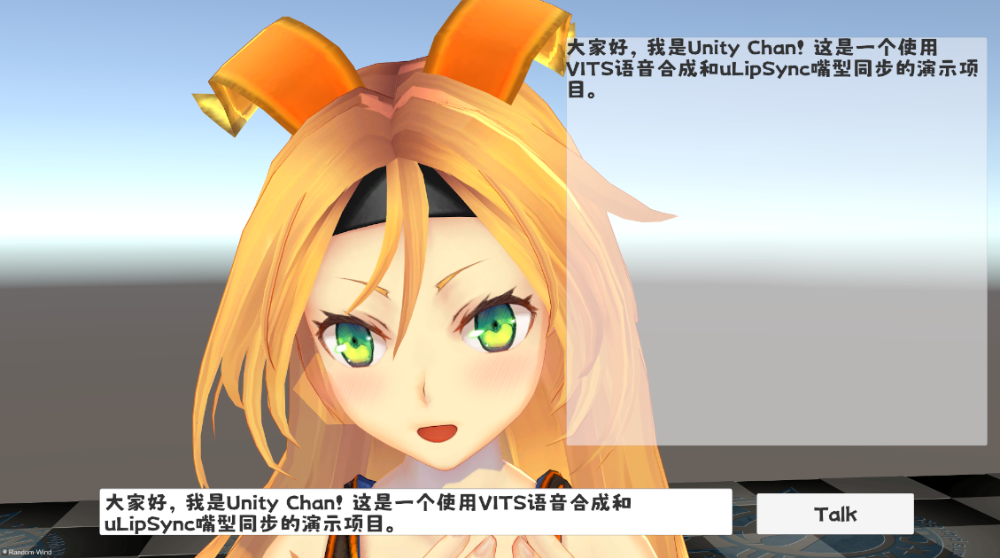

# VirtualHuman

VirtualHuman是一个快速在Unity引擎中使用您的大语言模型、语音生成模型的插件，可用于实现AI女友、AI助手等功能。

需要注意的是，此插件不提供任何模型。

## 演示 

哔哩哔哩: https://www.bilibili.com/video/BV1fX4y1E7ra/

使用LLM&&VITS在Unity中制作AI女友的示例。

配合uLipSync同步唇形的示例 (https://github.com/hecomi/uLipSync) 。

## 环境配置（非Unity）
### Local LLM (如使用ChatGPT可不需要)：

1. KoboldAI-KoboldCPP https://github.com/LostRuins/koboldcpp

2. Text-Generation-WebUI https://github.com/oobabooga/text-generation-webui

3. ChatGLM-6B https://github.com/THUDM/ChatGLM2-6B

### VITS:
1. VITS Simple API https://github.com/Artrajz/vits-simple-api

## 使用方式
1. 打开示例场景Sample.unity
2. 配置VITSController的地址和端口
3. 选择使用的LLM类型（如不使用则在翻译流程后由VITS直接进行语音生成）
4. 配置相应的LLM Controller
5. 选择翻译的流程
6. 配置翻译的语言类型，<b>Language Code</b>请参考(https://cloud.google.com/translate/docs/languages)填写

## LLM类型说明

### ChatGPT 3.5
- 使用ChatGPT请确保相应的网络环境
1. 在GPTController中填写OpenAI的<b>APIKey</b>
2. 在``m_Prompt``中填写人物设定、背景设定等

### KoboldAI-KoboldCPP
- KoboldAI-KoboldCPP并非一个模型而是用于加载模型的文本生成软件
- 你可以在KoboldCPP中使用任何支持的LLM模型
1. 在KoboldController中填写地址和端口
2. 在``charaPreset``中填写人物设定
3. 点击``Generate Memory``序列化上述设定至``generatedMemory``

### Oobabooga-Text-Generation-WebUI
- 配置Oobabooga-Text-Generation-WebUI的步骤与KoboldCPP基本一致

### ChatGLM-6B OpenAI-API
1. 在GLMController中填写地址和端口
2. 在``m_Prompt``中填写人物设定、背景设定等

## 其他说明

### VITS
1. ``Smart Reading`` 使VITS跳过Kobold生成的动作、人物表情描述（通常以``*``开头和结尾）

### Google Translation
- 对LLM、用户输入输出、VITS的语言类型进行分类
- 如果判断当前语言不同于指定语言将使用Google翻译，因此请确保相应的网络环境

## 待添加整合功能
- ChatGPT 4.0